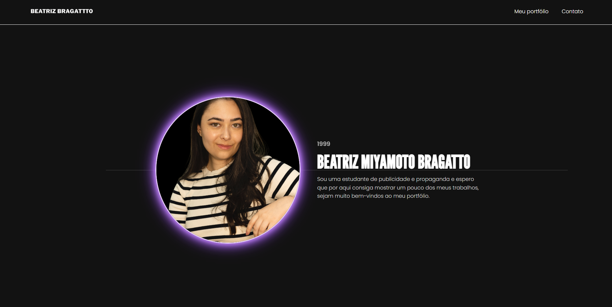
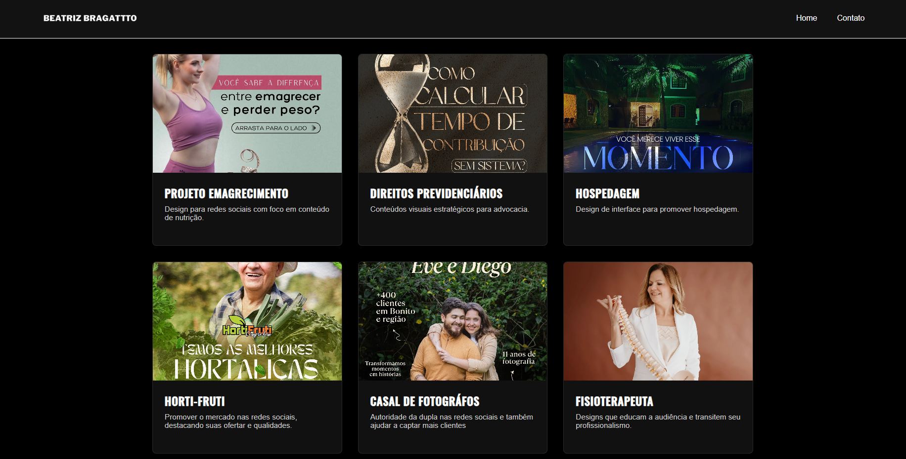
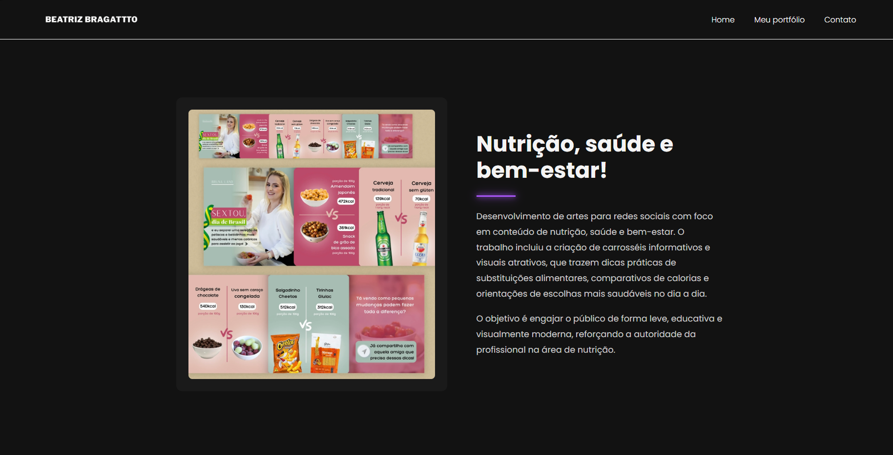
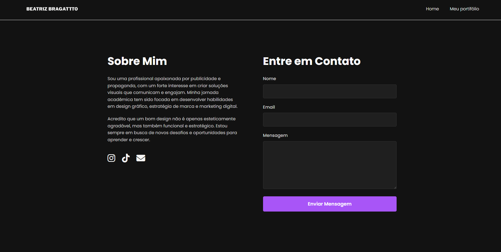

# PROJETO

## 💡 Processo de Ideação
Na área da Publicidade e Propaganda, as ideias precisam de uma vitrine, pois seus designs são seus produtos. Este projeto surge como resposta a essa necessidade, fazendo um espaço digital exclusivo para uma profissional da área. O site foi idealizado para ser o principal palco de suas criações, facilitando o compartilhamento de seu esforço e visão criativa com o mercado.

## 📌 Título do Projeto
Portifólio profissional.

## 👥 Integrantes do Grupo
- Guilherme Miyamoto Bragatto(10736124)
- Pedro Henrique Lopes Sabainsk (10735777)
- Joaquim Marcondes (10736261)
  
## 📝 Proposta Sintetizada do Projeto 
Desenvolver uma plataforma digital para consolidar a marca pessoal de uma publicitária, apresentando sua identidade, competências e portfólio de maneira profissional.

## 🖼️ Protótipo Inicial
Imagens do check-in 2

  
  
  
  

## 🌍 Caráter Extensionista
Pois o projeto entra como solução que atende a uma necessidade real e imediata da comunidade: o desenvolvimento de um portfólio digital para a irmã de um dos integrantes, impactando diretamente sua carreira e capacidade de divulgação profissional.

## 🤝 Colaborador Externo  
- Representante: Beatriz Miyamoto Bragatto (Profissional no mercado de publicidade e propaganda)

## 💻 Explicação do Código (Tutorial)
Tecnologias Utilizadas
- HTML5: Utilizado para a estruturação semântica de todo o conteúdo, garantindo acessibilidade e otimização.
- CSS3: Responsável por toda a estilização visual, interatividade via pseudo-classes e responsividade.
- JavaScript: Foi usado para adicionar dinamismo e interatividade do lado do cliente, melhorando a experiência do usuário com animações e validações funcionais.

Explicações do Código
- Página Inicial (index.html): O layout central foi criado com CSS Grid (display: grid), dividindo a seção em duas colunas (imagem e texto). O destaque visual da foto é um efeito de "brilho neon", usando a propriedade box-shadow, que aplica múltiplas camadas de sombra para simular a luz.
- Página de Portfólio (portifolio.html): A galeria de projetos é a parte de maior importância desta página. Ela foi construída com CSS Grid Layout, usando grid-template-columns: repeat(3, 1fr) para criar uma grade responsiva. A interatividade acontece por conta do efeito de :hover nos cards, que usa o transition para suavizar a mudança de cor da borda e o aparecimento de um box-shadow, destacando o projeto selecionado.
- Páginas de Projeto (projeto.html): Para o detalhamento de cada projeto, o layout de duas colunas (imagem e descrição) foi feito com CSS Flexbox (display: flex). Usada para alinhar itens em um único eixo. A linha decorativa abaixo do título utiliza a tag (hr) estilizada com box-shadow para replicar o efeito neon da identidade visual.
- Página de Contato (contato.html): O formulário e a seção "Sobre" são colocados lado a lado com Flexbox. A usabilidade do usuário no formulário é aprimorada com a pseudoclasse :focus, que muda a borda e adiciona um brilho ao campo selecionado, para melhor visualização do usuário.
- Responsividade: O site foi adaptado para dispositivos móveis através de Media Queries (@media), adaptamos para 3 tipos de tela(600px,768px e 900px). Conforme a largura da tela diminui, a grade de projetos se ajusta de 3 para 2 e depois 1 coluna. Da mesma forma, os layouts Flexbox mudam sua direção de row para column, empilhando os elementos para melhor visualização dependendo do dispositivo.
- Animação de Entrada no (portifolio.js): Teve como objetivo criar um efeito visual, onde os projetos aparecem na tela de forma gradual, em vez de todos de uma vez. O código carregamento completo do conteúdo da página usando o evento DOMContentLoaded.
Ele seleciona todos os elementos com a classe .card e utilizando um forEach, percorre cada card e aplica um setTimeout. A função setTimeout cria um pequeno atraso (index * 150 milissegundos) que aumenta a cada card.
- Validação do Formulário de Contato (formulario.js) Teve como objetivo garantir que o usuário preencha todos os campos do formulário antes de tentar enviá-lo. Também espera o evento DOMContentLoaded para ser executado. Quando o usuário tenta enviar, a função event.preventDefault() é chamada imediatamente. Isso impede o comportamento de recarregar a página. Então o código verifica se os campos de nome, email ou mensagem estão vazios (.value === ''). Se todos os campos estiverem preenchidos, um alert de sucesso é mostrado e o método form.reset() limpa o formulário para uma nova mensagem.

## Conclusão e Aprendizados Adquiridos
O projeto além de desafiar o trabalho em equipe, nos coloca em desafio com o desenvolvimento com os conceitos de HTML5, CSS3 e JavaScript. O maior desafio foi integrar todas as páginas de forma consistente e que façam sentido umas com as outras de acordo com que fossemos projetando, pois o CSS deveria conversar com HTML e o JS deveria estar de acordo com o que foi posto dos outros. Mas a parte que mais aprendemos foi com o JavaScript, pois além de ser uma linguagem um pouco mais nova para nós, tivemos uma dificuldade de impleentá-la. Portanto o projeto deixou claro a importância que devemos dar para a usabilidade do cliente, devemos nos importar com seu dispositivo e se ele é intuitivo ou não, desse modo enquanto faziamos o código, estavamos atuando também como alguém que iria usar o site para assim ter o melhor resultado.
